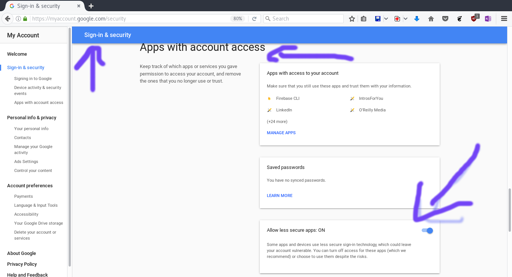

# laravelAccountCreationWithEmailVerification

## About this

This is a resume about different things (it's for my reference, and you may find it useful), around the implementation of a users registration with email confirmation (laravel examples, and different way of doing, and a resume of some good practice), and more then that about creating your own mail server, using some of the great open source projects. And resuming the concerns of having your own mailing server vs using a  cloud service. Also how to send using smtp, and others protocols. so it's about user registration and email servers.  [note, i will be updating that through time passing. (i'm not putting all at once)]


## First: User registration with email confirmation in laravel. Using events and a listener

You find an implementation in the folder **accountEmailConfirmation**<br/>It's a direct follow of this online artical tutorial  https://phpbits.in/email-verification-with-laravel-5-5/

Note bellow you will find a resume, and some outlines, and important notes.
Know that there is more then what in the tutorial, and it can be interesting. i will highlight in bold the very interesting or maybe important things.

### Here is a resume : 
We will be using the laravel default auth scaffolding (but follwing the same logic we can use others libraries for that. as laravel-permission by spatie for example).

#### The principal is as follow :
first we will add to the **users** table (and so the schema) a new field which is **'verified'**
we create another table **verification_tokens** (it will have a direct one to one relation with the users table) [each user will have his unique token]
(after setting the migration, and the env config and the database, we can launch the migrate to create the tables)

**Models:** <br/>There the User model and the VerificationToken model. The relationship between the two is a one to one relation. So we will set that. In VerificationToken we create a `user` methode, and in the User model, we create a verificationToken methode. both will allow us to set the relationship, and to access one model through the other. 
Also we will add `hasVerifiedEmail` to the `User` model. 

**Note:** don't forget to add the tables entries to `fillable` property. check it out. And that to avoid a **Mass Assignement error**. See the resources section bellow to learn about this error. 

**Controllers:**<br/>We add a controller for verification (VerificationController) wich contain a method **verify** (set user to verified) and another to resend the email (**resend**).

And we have to overide the methode of the auth registration and login controllers, (**registered** for registration and **authenticated** for login). We set it to logout and show the relevant messages and redirect. [after registration we redirect to login page and we show verify your email message. or if wanted we login the user. and we show the message too. not part of the tuto, we can then limit his access. Through checking his status (using conditions in the views. or using a role managment library as laravel-permission for example, and then we will set a role for that state, and associate it to him, and so he will be limited in access)]

For the verification controller, in resend email, we trigger an event for email resend which we would have created, and we have a listener that handle that. we are seeing that next.

**Events and there listeners:**<br/>There is different ways of implementing that. We will see too another way which is not part of that tuto. but the way in this tuto is through using the events and the listeners, it give a nice way that is flexible. Events let us easily organize the workflow, and the systematic between the different elements. 

Here how it's done in the tuto, and it's stright forward. we set two events, one is user registred event. The other is  user email resend request event.  Then we have a listener that listen to both of those event. Whenever one is triggered, we send the confirmation email to the user through the listener, which will trigger the action.  [know that we emit the events, ourselve, in the right place. And in this tuto: It is emited by the use of `UserRegistred` event, through `created` method of User model, and that is set through the binding using the service provider userRegisteredProvider that we create. (When this function is triggered! the confirmation token will be generated and the the userregistered event is emited right away. [we will come back to this provider in next section] ) ] (check the outline section: we can not to use a serviceProvider, for this even emiting, and implement the same in `registered` overided methode in registration auth default controller).  For the resend Event, it's emited from within the resend methode of the VerificationController we have created. (it's executed, through a route that we set, and so through a message we show to the user, with the link to resend [that message is shown after you try to login before you are verified (that in the tuto), In this i added this resend also to the message that show after registration, that ask you to check your email.])

Now the event listener. We create it. And let it handle the email sending.

**Note:**<br/> you need to register the events and there listeners. In laravel we do that through the property **\$listen** in the **EventServiceProvider**. Check it out. 
Know that in place of creating the Events and Listeners files and the folders manually, you can just register them first, and then with ***php artisan Event:generate** all files get created for you. (the one already created will be note overided, and only the new one will be added)
Know too that you can manually register them, and not through **\$listen** property of **EventServiceProvider** (see the doc: https://laravel.com/docs/5.6/events#manually-registering-events) 


**Services providers:**<br/>UserCreatedProvider is created, and is used to bind and overide the `created` methode of the user Model. => when the user is created through this function we generate the verification token and we emit the event UserRegistered, so the listener will send the verification email.

**Note:** that this is not necessary:
==> option one! is to do that in `registered` methode of the registration Auth  controller. But with what was done in the tuto, we have the advantage of a better load time. because, the user created event is triggered first  and so the `created` run before `registered` methode. 
==> option two! why not just overide it in User model directly. (i'm going to check this out.)

**Routes:**<br/>We add the two routes for the  verification controller functionalities. One that will run `verify` method, and the other for `resend` method. 

**Mail sending**<br/>To send the mail, we will be using laravel Mail system, the `mailable` class. we generate it using `php artisan make:mail SendVerificationToken`


**Env configuration:**<br/>====> database config:

====> **smtp config when using google:**<br/>**!!!!! Here a resume of All the process !!!!!** 

All start at registeration, (we are using laravel default template). Register => and you get the registration form. you enter the registeration data. and you send the form. All that is handled with the default laravel Auth scaffolding. after the registeration finish successefuly, the methode registered, from Auth/RegisterController that overide the one of the default trait used by the auth scaffolding. It's executed. And in this tuto, it's work is to logout and redirect to login with a message to check the email to confirm. (logout because by default, with auth scaffolding after registeration the user is automatically logged in [that behavior can be overided by overiding register methode, the same as with registered] (here a link for that: https://stackoverflow.com/questions/43226145/laravel-5-4-disable-auto-login-after-registration) [you take the code from the trait and just remove `$this->guard()->login($user)`; and may be modify it to redirect else wher ]. Another link: https://laracasts.com/discuss/channels/laravel/laravel-55-disable-auto-login-after-registration?page=1). Well we droped away. Here we continue. It was registred and it log out and show a message. In the same time (and that as the tuto did) the method created of user. is executed. after user creation. (that was done through the userCreatedServiceProvider, and it's binding of the function). So when that happen it litteraly will generate a verification token for the user. And emit userRegistered event. (Note: created methode get executed before, registered methode. That fact can add a little better load time. Because otherwise we could did all in registered methode [you can have a demo, by switching to the branch "accountEmailConfirmationWithoutUserCreatedProvider" of this repo => `git checkout accountEmailConfirmationWithoutUserCreatedProvider`]). Now we have an event that was emited, so the listener will execute the handle function to handle it. the email verification link is sent to the recipient user. All left is for him to use that link. And that will activate his account (that happen through the corresponding controller (following the used route we set for that). Which will change using the model the verified entry. and that's it). One last lefting for all that. the resend functionality, to resend the verification email again. for that we have a controller. and what it did, is emit resendEvent. which will trigger the listener which will send the email. in the tuto, resend message show only when you try to login and you are not verified yet.  You can change that, and add the resend option, for the message stright after registration (that in registered overided methode of the registeration auth controller).  So That's the principle, and how things works.


==> **we can use other things see the outline bellow [mail servers and configurtation and  some different options]**<br/>### Here some of the important outline, and things you may find useful, and may be some trouble shooting, or things you may avoid:

**About the implementation above and tuto**<br/>**-------> creating token in created and not registered**<br/>Using `created` methode (that is executed when the user is created) to create the token and trigger the UserRegistered event, that will imply sending the mail through the listener handling to the event. Rather `registered` method of the registeration  auth controller. Give a better load time, because `created` get executed first. And `registered` just after, we let it handle only the logout and the redirection whith showing the message. And they get executed separatly and asynchrounously. 

**----> Add resend link to the after registeration and resend messages**<br/>Yea! in the tuto The author didn't does that. But it's a good practice. You can't know for sure if your message will be sent. Adding that is great. You can check it out. I did it in this overview. You form a link 
```php
'Didn\'t get it? <a href="' . route('auth.verify.resend') . '?email=' . $user->email .'">Resend.</a>');
``` 
for example. Also it's good to add it to the message after resend (VerificationController).

**Using Google gmail account to send the emails**<br/>If you are going to use the smtp server, you need to set the config to **.env** config file (check it out). But a problem as today you will encounter, is that google will block the tentative to send, because of there new security policy. They have disabled direct smtp operation. And all apps will be blocked. You need to enable allow less secure apps through your gmail settings here a link for that: https://myaccount.google.com/lesssecureapps
or by going through "account => sign & security => Apps with account access" you find it all down.


Otherwise you go the secure way, and that throug applying to the oauth2.0 and google policy. (we will treat that later)

**Mail server and the options**<br/>to send mails in the end a mail server is needed. Two options come here, setup your own server or use a mail server as a service. Cloud services now a day are too interestings.  You can too, use gmail and others mailing platform that allow sending mails through smtp. Even others methods.  

**Using your own local mail server**<br/>One of the options is to implement your own mail server. In a company, they may already have one. In such case you just use there's. But if you want to implement your own mail server. See the section Mail server bellow. You will find all different best options. like using **IRedMail** for that. And you will find a good overview about mail servers, it's administration, It's construction, and parts. How the tools make it easy. And also why using cloud services that offer that is one of the options. And can be interesting. And why not too.

**NOTE:** Whatever mail server you are going to use. You need to set the appropriate settings to make sure it works.


**Using queue for better performance**<br/>We will cover that in the next project. So go see **Second** section. 

**Trouble shooting**<br/>Mass Assignement error: don't forget to set the fillable properties of you Model.
mysql mariadb length error:

### Resources that can be helpful:

**Laravel events and listeners**
https://laravel.com/docs/5.6/events#manually-registering-events

**Laravel mail**
https://laravel.com/docs/5.6/mail

**Laravel Mass assignement error**<br/>## Second: User registration with email confirmation in laravel. Using queue

This against the first methode will have the advantage of a better performance. And a better page loading time.

... to be continued


## Mail servers

### What is a mail server


### building your own mail server

### Mail servers as a cloud service 


--------------------------------
// now this work is in progress! depending in my time.